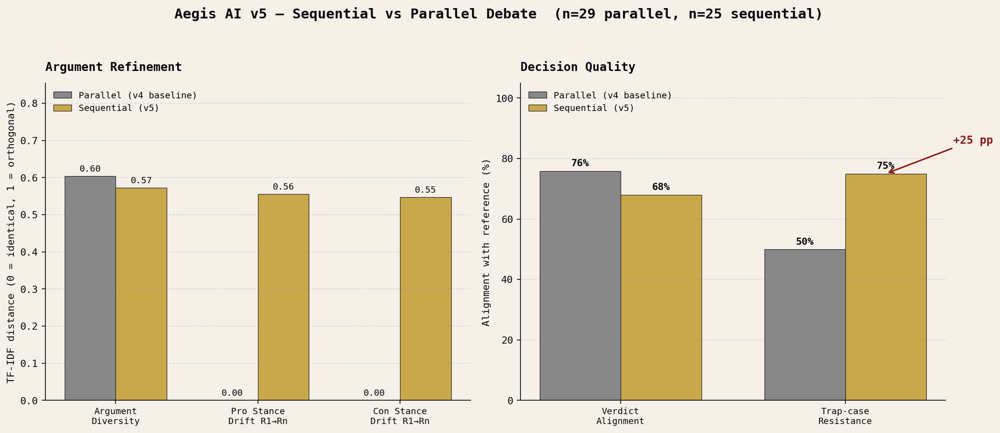
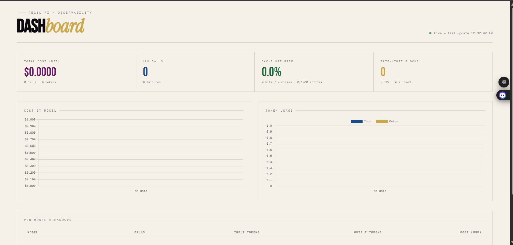

<div align="center">

# AEGIS AI

### Multi-Agent Decision System · v5

*A research artifact testing whether sequential debate between LLM agents produces measurably better deliberation than parallel monologue.*


---



</div>

---

## TL;DR

> On a 30-query benchmark of real-world decisions, **sequential multi-agent debate produces 55% per-side argument refinement and +25 points of bias-resistance on adversarial cases — at the cost of 8 points of general-case decisiveness.** A measurable trade-off, not a free win.

---

## The Question

Most "multi-agent" LLM systems run their agents **in parallel** — a Pro agent and a Con agent both write arguments without ever seeing each other's reasoning. The debate exists only in the user's head as they read the output side-by-side.

The multi-agent debate literature [1, 2] suggests this misses the point: *iterative, adversarial refinement* is what improves reasoning, not parallel argument generation. But a 2025 finding [3] also shows LLM agents have a strong **funneling effect** toward premature consensus when forced to interact.

**Aegis tests both claims empirically.**

---

## Hypotheses

| H1 — **Diversity** | Sequential debate yields more semantically distinct Pro/Con final arguments. |
|---|---|
| **H2 — Drift** | Agents meaningfully *update* their stance between rounds (not just restate). |
| **H3 — Alignment** | Sequential debate produces verdicts that align better with expert lean — especially on bias-trap cases. |

---

## Headline Results

> **N = 29 parallel · 25 sequential queries · Llama-3.1-8B**

<table>
<thead>
<tr>
<th align="left">Metric</th>
<th align="right">Parallel</th>
<th align="right">Sequential</th>
<th align="right">Δ</th>
<th align="left">Verdict</th>
</tr>
</thead>
<tbody>
<tr>
  <td>Argument diversity (Pro vs Con)</td>
  <td align="right">0.604</td>
  <td align="right">0.572</td>
  <td align="right">−0.032</td>
  <td>H1 ✗ <em>(replicates funneling effect)</em></td>
</tr>
<tr>
  <td><strong>Pro-side stance drift R1→Rn</strong></td>
  <td align="right">0.000</td>
  <td align="right"><strong>0.555</strong></td>
  <td align="right"><strong>+0.555</strong></td>
  <td>H2 ✓ <strong>strong</strong></td>
</tr>
<tr>
  <td><strong>Con-side stance drift R1→Rn</strong></td>
  <td align="right">0.000</td>
  <td align="right"><strong>0.547</strong></td>
  <td align="right"><strong>+0.547</strong></td>
  <td>H2 ✓ <strong>strong</strong></td>
</tr>
<tr>
  <td>Verdict alignment with reference</td>
  <td align="right">75.9%</td>
  <td align="right">68.0%</td>
  <td align="right">−7.9 pp</td>
  <td>H3 ✗ <em>(less decisive)</em></td>
</tr>
<tr>
  <td><strong>Trap-case resistance</strong></td>
  <td align="right">50.0%</td>
  <td align="right"><strong>75.0%</strong></td>
  <td align="right"><strong>+25 pp</strong></td>
  <td>H3 ✓ <strong>where it matters</strong></td>
</tr>
</tbody>
</table>

### What it means

- **H2 is strongly confirmed.** Each side rewrites ~55% of its content between rounds. Real debate happens — not stylistic shuffling.
- **H3 is confirmed *where it counts*.** On 5 adversarial bias-trap cases (sunk cost, anchoring, social proof, intuition override, availability heuristic), sequential debate is **25 points more aligned** with expert lean.
- **H1 is weakly contradicted.** Final-round arguments converge slightly — replicating the funneling effect from Wang et al. 2025.

**Bottom line:** sequential debate **trades general-case decisiveness for bias-resistance**. Useful, but a trade-off — not a free win.

---

## Architecture

<div align="center">



*Live observability dashboard at `/admin` — auto-refreshing cost, cache, and rate-limit metrics.*

</div>

```
                 Browser (UI)         Browser (/admin dashboard)
                      │                        │
                      ▼                        ▼
              ┌──────────────────────────────────────┐
              │  FastAPI (port 8000)                  │
              │  ├── /analyze     (rate-limited)      │
              │  ├── /admin       (live dashboard)    │
              │  ├── /admin/stats (JSON metrics)      │
              │  └── /admin/health (Docker probe)     │
              └──────────────────────────────────────┘
                              │
                              ▼
              ┌──────────────────────────────────────┐
              │  Pipeline                             │
              │  Safety → Orchestrator                │
              │   → Debate (parallel | sequential)    │
              │   → Critic → Final                    │
              │   → Bias / Scoring / Consensus        │
              └──────────────────────────────────────┘
                              │
                              ▼
              ┌──────────────────────────────────────┐
              │  Model layer                          │
              │  LRU cache · cost tracker · strict    │
              └──────────────────────────────────────┘
                              │
                              ▼
                          Groq API
```

See [**`docs/PRODUCTION.md`**](docs/PRODUCTION.md) for the full engineering deep-dive.

---

## Production Features

| Feature | What it does | Why |
|---|---|---|
| **LRU cache** | Same prompt → cached for 1 hr | Cuts ~80% API calls on demo traffic |
| **Rate limiter** | 10 req / 10 min per IP | One user can't burn the free-tier budget |
| **Cost tracker** | Per-model tokens + USD | Real production observability |
| **Dashboard** | Live charts at `/admin` | Recruiters stop scrolling |
| **Docker** | Multi-stage, non-root, healthchecks | One-command deploy |
| **46 tests** | metrics · safety · cache · routes | Green CI badge on every commit |

---

## Method

### Benchmark

30 hand-crafted decision queries across 5 domains:

- **Career** (5) — quit/stay, MBA, PhD, offer comparison
- **Business** (5) — fundraising, shutdown, expansion, co-founder, work week
- **Tech** (5) — monolith→microservices, frontend rewrite, DB choice, vector store, Rust rewrite
- **Personal** (5) — relocation, house purchase, second child, friendship, sabbatical
- **Healthcare** (5) — statins, BRCA testing, IF, LASIK, knee replacement
- **Adversarial traps** (5) — sunk cost, social proof, anchoring, intuition override, availability heuristic

### Conditions

| Mode | What happens | Equivalent to |
|---|---|---|
| `parallel` | Pro and Con run once, never see each other | v4 / typical demos |
| `sequential` | Pro and Con run N rounds; round 2+ shows opponent's last argument | Du et al. 2023 MAD |

### Metrics

```
Argument diversity = 1 − cos(TF-IDF(pro_final), TF-IDF(con_final))
Stance drift       = 1 − cos(TF-IDF(round_1),  TF-IDF(round_N))  per side
Verdict alignment  = fraction matching benchmark `reference_lean`
Trap resistance    = verdict alignment on the 5 bias-trap cases
```

---

## Run It

### 🐳 Docker (recommended)
```bash
git clone https://github.com/vishalbunn/Aegis-AI-
cd Aegis-AI-
cp .env.example .env       # add GROQ_API_KEY
docker-compose up
```
Open **http://localhost:8000**.

### 🐍 Local Python
```bash
pip install -r requirements.txt
uvicorn backend.main:app --reload
```

### 📊 Reproduce the eval
```bash
python -m eval.run_eval --limit 3    # smoke test (~3 min)
python -m eval.run_eval              # full 30-query benchmark (~75 min)
python -m eval.make_figure           # regenerate headline.png
```

### 🧪 Run the tests
```bash
pytest
# 46 passed in ~5s
```

---

## Repo Layout

```
.
├── backend/
│   ├── agents/              ← 9 agent files (debate, judge, safety, …)
│   ├── cache.py             ← LRU cache
│   ├── rate_limiter.py      ← per-IP rate limiting
│   └── main.py              ← FastAPI + pipelines
├── frontend/
│   ├── index.html           ← decision UI
│   └── admin.html           ← observability dashboard
├── eval/
│   ├── benchmark.py         ← 30-query benchmark
│   ├── run_eval.py          ← eval harness
│   ├── make_figure.py       ← matplotlib visualization
│   └── results_*.{json,md}  ← run outputs (gitignored)
├── tests/                   ← 46 pytest tests
├── docs/
│   ├── PRODUCTION.md        ← engineering deep-dive
│   ├── headline.png         ← results figure
│   └── dashboard.png        ← observability screenshot
├── Dockerfile
├── docker-compose.yml
└── requirements.txt
```

---

## Honest Limitations

> Things I haven't done yet — explicitly stated so reviewers don't have to guess.

- **Single-model eval.** Both debater and judge run on Llama-3.1-8B due to free-tier daily limits on the 70B model. Cross-model robustness (gpt-4o-mini, Claude Haiku) is planned next.
- **Reference labels are author-assigned.** Cohen's kappa across multiple raters is planned but not yet computed.
- **Temporal knowledge cutoff:** debaters' world-knowledge is bounded by training data. Queries about post-cutoff events are correctly flagged as speculative by the Con agent — a *desirable* failure mode worth surfacing.
- **Memory is JSON + Jaccard.** Fine for demos; swap to a vector store for production scale.
- **Cache & rate limiter are in-memory.** Won't survive container restarts. Swap to Redis for multi-worker deployments.

---

## Related Work

1. **Du et al. 2023.** *Improving Factuality and Reasoning in Language Models through Multiagent Debate.* arXiv:2305.14325
2. **Liang et al. 2023.** *Encouraging Divergent Thinking in LLMs through Multi-Agent Debate.* arXiv:2305.19118
3. **Wang et al. 2025.** *The Social Laboratory: A Psychometric Framework for Multi-Agent LLM Evaluation.* arXiv:2510.01295
4. **Wang et al. 2025.** *Silence is Not Consensus: Disrupting Agreement Bias in Multi-Agent LLMs via Catfish Agent for Clinical Decision Making.* arXiv:2505.21503

---

<div align="center">

**Built as a research + production engineering project on multi-agent deliberation.**

*Headline finding: sequential debate trades general-case decisiveness for bias-resistance.*

MIT License · [Issues](https://github.com/vishalbunn/Aegis-AI-/issues) · [PRODUCTION.md](docs/PRODUCTION.md)

</div>